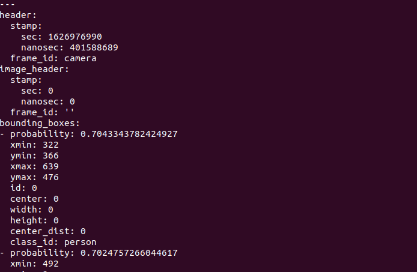
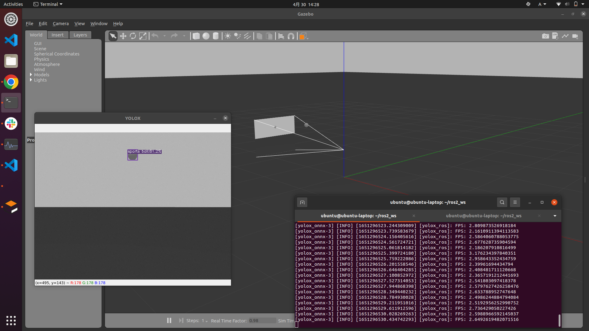
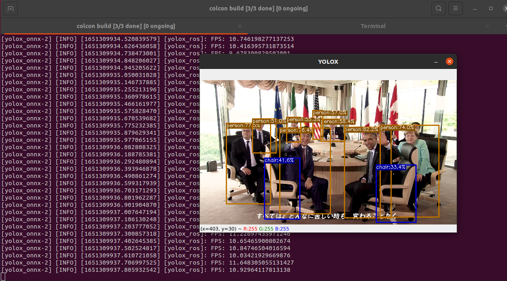

# YOLOX-ROS

[YOLOX](https://github.com/Megvii-BaseDetection/YOLOX) + ROS2 Foxy demo


<div align="center">🔼 Unity + YOLOX-ROS Demo</div>

## Supported List

| Base            | ROS2 C++ | ROS2 Python |
| --------------- | -------- | ----------- |
| PyTorch         |           | ✅           |
| PyTorch(CUDA)   |           | ✅           |
| PyTorch(CUDA-FP16) |           | ✅           |
| TensorRT (CUDA) |  ✅       |              |
| OpenVINO        |  ✅       | ✅           |
| ONNX Runtime    |           | ✅           |
| TFLite          |           | ✅           |

### Raspberry Pi4 🍓 + NCS2 + YOLOX-ROS

Good news for studets❗🍓

Check [GitHub Wiki](https://github.com/Ar-Ray-code/YOLOX-ROS/wiki/YOLOX-ROS---Raspbian-(NCS2)) to try YOLOX-ROS.

## Installation & Demo
<details>
<summary>Python (PyTorch)</summary>

## Requirements

- ROS2 Foxy
- OpenCV 4
- Python 3.8 (Ubuntu 20.04 Default)
- PyTorch >= v1.7
- [YOLOX v0.3.0](https://github.com/Megvii-BaseDetection/YOLOX)
- [bbox_ex_msgs](https://github.com/Ar-Ray-code/bbox_ex_msgs)

## Installation

Install the dependent packages based on all tutorials.

### STEP 1 : Download from GitHub

```bash
mkdir -p ~/ros2_ws/src
cd ~/ros2_ws/src
git clone https://github.com/Ar-Ray-code/yolox_ros.git --recursive
```

### STEP 2 : YOLOX Installation (yolox_ros_py)

```bash
pip3 install yolox
```

### STEP 3 : Install YOLOX-ROS

```bash
source /opt/ros/foxy/setup.bash
sudo apt install ros-foxy-v4l2-camera
# source /opt/intel/openvino_2021/bin/setupvars.sh # <- Using OpenVINO
colcon build --symlink-install # weights (YOLOX-Nano) files will be installed automatically.
```

**Automatic download weights**

- yolox_nano.onnx by [Megvii-BaseDetection/YOLOX](https://github.com/Megvii-BaseDetection/YOLOX)
- yolox_nano.pth by [Megvii-BaseDetection/YOLOX](https://github.com/Megvii-BaseDetection/YOLOX)
- model.onnx by [Kazuhito00](https://github.com/Kazuhito00/Person-Detection-using-RaspberryPi-CPU)
- model.tflite by [Kazuhito00](https://github.com/Kazuhito00/Person-Detection-using-RaspberryPi-CPU)

### (Step 3) Using CUDA

If you have NVIDIA Graphics, you can run YOLOX-ROS on GPU.

**Additional installing lists**

- NVIDIA Graphics Driver
- CUDA toolkit (11.0)
- torch+cuda

```bash
source /opt/ros/foxy/setup.bash
sudo apt install ros-foxy-v4l2-camera
colcon build --symlink-install # weights (YOLOX-Nano) files will be installed automatically.
```

### Step : Demo

Connect your web camera.

```bash
source /opt/ros/foxy/setup.bash
source ~/ros2_ws/install/local_setup.bash
ros2 launch yolox_ros_py yolox_nano_cpu.launch.py # <- CPU (PyTorch)
# ros2 launch yolox_ros_py yolox_nano.launch.py # <- GPU (PyTorch)
# ros2 launch yolox_ros_py yolox_nano_onnx.launch.py # <- ONNXRuntime

# OpenVINO -------------------------------------
# source /opt/intel/openvino_2021/bin/setupvars.sh
# ros2 launch yolox_ros_py yolox_nano_openvino.launch.py
```

</details>

<details>
<summary>C++</summary>

Check [this URL](https://github.com/Ar-Ray-code/YOLOX-ROS/tree/main/yolox_ros_cpp).

</details>

<br></br>

## Topic

### Subscribe

- image_raw (`sensor_msgs/Image`)

### Publish

<!-- - yolox/image_raw : Resized image (`sensor_msgs/Image`) -->

- yololx/bounding_boxes : Output BoundingBoxes like darknet_ros_msgs (`bboxes_ex_msgs/BoundingBoxes`)

  ※ If you want to use `darknet_ros_msgs` , replace `bboxes_ex_msgs` with `darknet_ros_msgs`.



<br>

## Parameters 

- Check launch files.

<br>

## Composition

- Supports C++ only.

<br>

## YOLOX-ROS + ?

<details>
<summary>Examples</summary>

### Web Camera (v4l2-camera)

- [yolox_nano_onnx.launch.py](./yolox_ros_py/launch/yolox_nano_onnx.launch.py)

```bash
ros2 launch yolox_ros_py yolox_nano_onnx.launch.py video_device:=/dev/video0
```


### Unity

- [Ar-Ray-code/RenderTexture2ROS2Image](https://github.com/Ar-Ray-code/RenderTexture2ROS2Image)


### Gazebo

- [yolox_nano_onnx_gazebo.launch.py](./yolox_ros_py/launch/yolox_nano_onnx_gazebo.launch.py)

```bash
ros2 launch yolox_ros_py yolox_nano_onnx_gazebo.launch.py
```



### YouTube

- [yolox_nano_onnx_youtube.launch.py](./yolox_ros_py/launch/yolox_nano_onnx_youtube.launch.py)
- [Ar-Ray-code/YouTube-publisher-ROS2](https://github.com/Ar-Ray-code/YouTube-publisher-ROS2)

```bash
# git clone https://github.com/Ar-Ray-code/YOLOX-ROS.git --recursive
vcs import . < YOLOX-ROS/youtube-publisher.repos
pip3 install -r YOLOX-ROS/requirements.txt
pip3 install -r YouTube-publisher-ROS2/requirements.txt
cd ..
colcon build --symlink-install --pacakges-select yolox_ros_py bboxes_ex_msgs youtube_publisher
source install/setup.bash

# run launch.py
ros2 launch yolox_ros_py yolox_nano_onnx_youtube.launch.py
```



</details>

<br>

## Reference


- [YOLOX (GitHub)](https://github.com/Megvii-BaseDetection/YOLOX)

```
@article{yolox2021,
  title={YOLOX: Exceeding YOLO Series in 2021},
  author={Ge, Zheng and Liu, Songtao and Wang, Feng and Li, Zeming and Sun, Jian},
  journal={arXiv preprint arXiv:2107.08430},
  year={2021}
}
```

<br>

## Contributors
- [Ar-Ray](https://github.com/Ar-Ray-code)
- [fateshelled](https://github.com/fateshelled)
- [Kazuhito00](https://github.com/Kazuhito00)

<br>

## About writer

- Ar-Ray : Japanese student.
- Blog (Japanese) : https://ar-ray.hatenablog.com/
- Twitter : https://twitter.com/Ray255Ar
