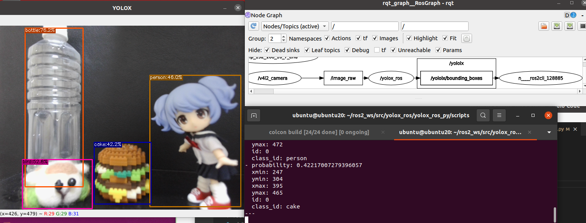

# YOLOX-ROS

---

+ [YOLOX 0.2.0](https://github.com/Megvii-BaseDetection/YOLOX/releases/tag/0.2.0)+ROS2 Foxy

<!-- __NVIDIA Graphics is required ❗❗❗__ -->




<!-- Japanese Reference (Plan to post)：[Qiita](https://qiita.com/Ar-Ray) -->

## Supported List

| Base        | ROS1 C++ | ROS1 Python | ROS2 C++ | ROS2 Python |
| ----------- | -------- | ----------- | -------- | ---------- |
| CPU        |          |            |          | ✅          |
| CUDA        |          |           |          | ✅          |
| CUDA (FP16) |          |           |          | ✅          |
| TensorRT    |          |             |          |   ❓     |
| OpenVINO    |          |             |          |            |
| MegEngine   |          |             |          |            |
| ncnn        |          |             |          |            |


## Requirements of simple demo (Python)

- ROS2 Foxy
- OpenCV 4
- Python 3.8 (Ubuntu 20.04 Default)
- [YOLOX-Standard and Depends](https://github.com/Megvii-BaseDetection/YOLOX)

## Requirements of simple demo (C++)

- C++ is not supported

## Installation

Install the dependent packages based on all tutorials.

### STEP 1 : YOLOX Quick-start

[YOLOX Quick-start (Python)](https://github.com/Megvii-BaseDetection/YOLOX#quick-start)

```bash
git clone https://github.com/Megvii-BaseDetection/YOLOX
cd YOLOX
pip3 install -U pip && pip3 install -r requirements.txt
pip3 install -v -e .  # or  python3 setup.py develop
pip3 install cython; pip3 install 'git+https://github.com/cocodataset/cocoapi.git#subdirectory=PythonAPI'
```

### STEP 2 : Install YOLOX-ROS

```bash
source /opt/ros/foxy/setup.bash
sudo apt install ros-foxy-v4l2-camera
git clone --recursive https://github.com/Ar-Ray-code/yolox_ros.git ~/ros2_ws/src/yolox_ros/
cd ~/ros2_ws
colcon build --symlink-install # weights files will be installed automatically.
```

### Using CUDA

If you have NVIDIA Graphics, you can run this on GPU.

**Additional installing lists**

- NVIDIA Graphics Driver
- CUDA toolkit (11.0)
- torch+cuda

## Demo

Connect your web camera.

```bash
source ~/ros2_ws/install/setup.bash
# Example 1 : YOLOX-s demo
ros2 launch yolox_ros_py yolox_s.launch.py
```

---

## Topic
### Subscribe

- image_raw (`sensor_msgs/Image`)

### Publish

- yolox/image_raw : Resized image (`sensor_msgs/Image`)

- yololx/bounding_boxes : Output BoundingBoxes like darknet_ros_msgs (`bboxes_ex_msgs/BoundingBoxes`)

  ※ If you want to use `darknet_ros_msgs` , replace `bboxes_ex_msgs` with `darknet_ros_msgs`.


## Parameters : default

- image_size/width: 640
- image_size/height: 480
- yolo_type : 'yolox-s'
- fuse : False
- trt : False
- rank : 0
- ckpt_file : `../../weights/yolox_s.pth`
- conf : 0.3
- nmsthre : 0.65
- img_size : 640

---

## Reference


- [YOLOX (GitHub)](https://github.com/Megvii-BaseDetection/YOLOX)

```
@article{yolox2021,
  title={YOLOX: Exceeding YOLO Series in 2021},
  author={Ge, Zheng and Liu, Songtao and Wang, Feng and Li, Zeming and Sun, Jian},
  journal={arXiv preprint arXiv:2107.08430},
  year={2021}
}
```

## About writer

- Ar-Ray : Japanese student.
- Blog (Japanese) : https://ar-ray.hatenablog.com/
- Twitter : https://twitter.com/Ray255Ar
